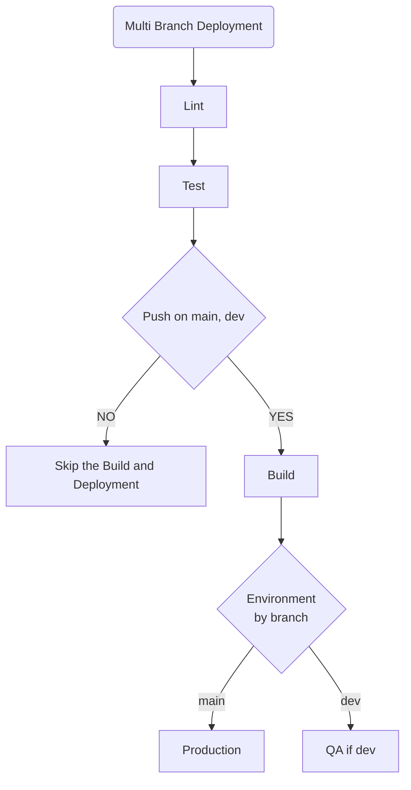
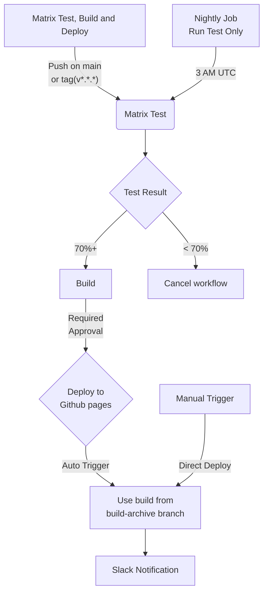

# Github Action 

## Multi-Branch Deployment

Action file: [multi-branch-deployment](./.github/workflows/multi-branch-deployment.yml)

Run on Every PR and Push on (main, dev):
- Lint: 
    - Description: Check code quality
- Test: 
    - Description: Test the code
    - Needs: Lint
- Build: 
    - Description: Build the react app
    - Condtion: Only if push on (main, dev)
    - Needs: Test
- Deploy to Production: 
    - Description: Deployment to Production Env.
    - Condtion: Only if push on (main)
    - Needs: Build
- Deploy to QA: 
    - Description: Deployment to QA Env.
    - Condtion: Only if push on (dev)
    - Needs: Build

## Matrix Testing & Conditional Build
Action file: [matrix-testing-and-conditional-build](./.github/workflows/matrix-testing-and-conditional-build.yml)

Run on Every PR and Push on (main, dev):
- Matrix Test: 
    - Description: Test Code on Nodejs 16, 18 and 20. On both `windows` and `ubuntu-latest`. Generate artifact for each version test
- Test Report: 
    - Description: Generate the summary of all tests, Fail if failure is more than 70%. Generate `matrix-test-coverage-summary.txt` artifact.
    - Needs: Matrix Test
- Build: 
    - Description: Build the react app. Generate build artifact
    - Condtion: Only if push on (main) OR push tag(v*.*.*)
    - Needs: Test Report
- Add Build to branch: 
    - Description: Save the most latest build in `build-archive` branch
    - Needs: Build
- Deploy to Github Pages: 
    - Description: Deployment to Github Pages. Pull the code from `build-archive` branch.
    - Condtion: Required manual approval. Either trigger by github action OR can also be triggered manualy (set direct_deploy = true)
    - Needs: Add Build to branch

- ✅: Add a summary step that concatenates test results.
- ✅: Fail workflow if a minimum number of tests decreases (track via saved artifact + diff).
- ✅: Introduce a scheduled run (cron) to test nightly against node:current. (Separate Job as it was becoming too complex)
- ✅: Add a manual workflow_dispatch input to skip build.

