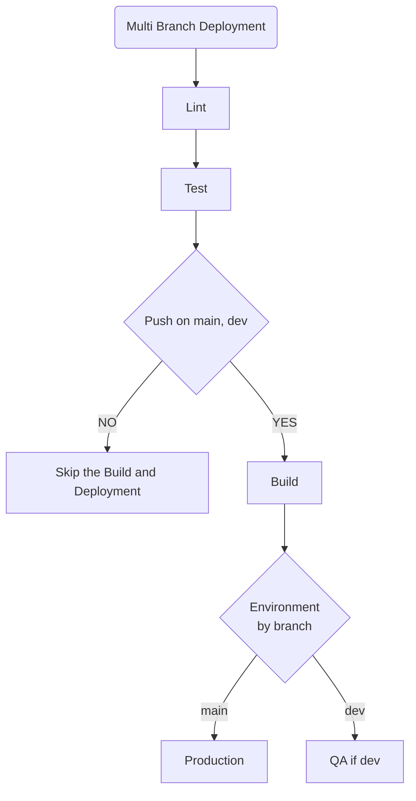
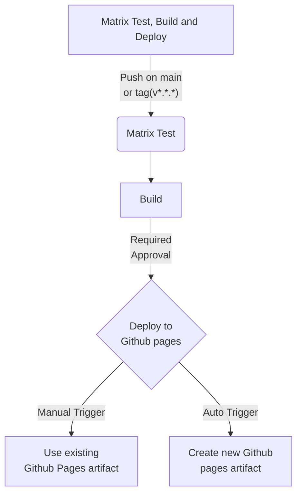

# Github Action 

## Multi-Branch Deployment

Action file: [multi-branch-deployment](./.github/workflows/multi-branch-deployment.yml)
Run on Every PR and for Push if on `main`, `dev` branch

Lint
Test
Build
Deploy to Prod
Deploy to QA

## Matrix Testing & Conditional Build
Action file: [multi-branch-deployment](./.github/workflows/matrix-testing-and-conditional-build.yml)
Matrix Test
Build
Deploy (self contained, if run alone then use old artifacts )

You must ensure your Node.js project works across multiple runtimes before building artifacts.

✅ Goals
Matrix Test for Node 16, 18, 20

Matrix Test Coverage Report
Build only when Push to main, OR Push a version tag matching v*.*.*.

Use artifacts to collect outputs.
Add manual approval before publishing build artifact.
- Yes
Cancel superseded runs on same branch.
- Yes

Add a summary step that concatenates test results.
- Yes
Fail workflow if a minimum number of tests decreases (track via saved artifact + diff).
- Yes
Introduce a scheduled run (cron) to test nightly against node:current.
- Yes
Add a manual workflow_dispatch input to skip build.
- Yes, (Direct Deploy option)
