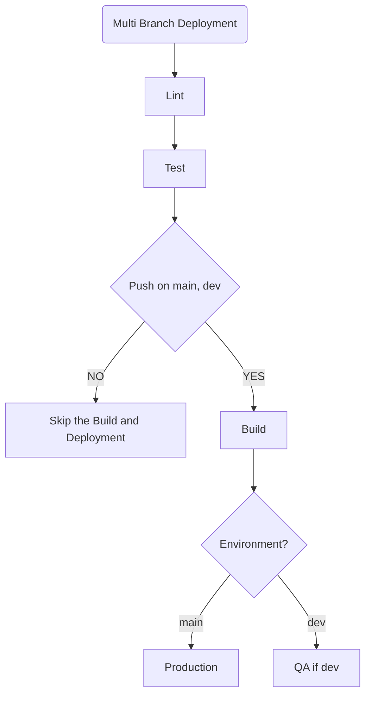

# Github Action 

## Multi-Branch Deployment

Action file: [multi-branch-deployment](./.github/workflows/multi-branch-deployment.yml)
Run on Every PR and for Push if on `main`, `dev` branch

```mermaid
flowchart TD
    A("Multi Branch Deployment") --> B["Lint"]
    %% A("Multi Branch Deployment") --> B{"CLI client 
    %% (gitviz-cli.js)"}

    B --> D["Test"]
    D --> E{"Push on main, dev"}
    E --> |NO| H["Skip the Build and Deployment"]
    E --> |YES| I["Build"]
    I --> J{"Environment?"}
    J --> |main| K["Production"]
    J --> |dev| L["QA if dev"]
```

